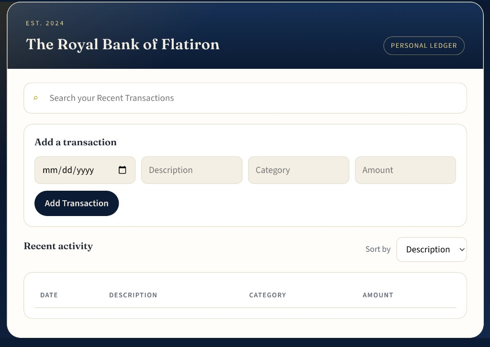

# The Royal Bank of Flatiron

A React banking app that lets you view, add, search, and sort personal transactions. This project also includes a Vitest testing suite for those features.

## Features

- **Display transactions** — loads the list from `json-server` when the app starts
- **Add transactions** — submits a new record with date, description, category, and amount
- **Search** — filters the table as you type (matches description or category)
- **Sort** — orders the table by description or category

## Getting Started

```sh
npm install
```

Start the frontend:

```sh
npm run dev
```

Start the backend (JSON API on port 6001):

```sh
npm run server
```

Open the URL shown by Vite (usually `http://localhost:5173`).

## Running Tests

```sh
npm test
```

The suite covers:

1. Transactions rendering on startup
2. Adding a transaction in the UI and sending a POST request
3. Search updating the page, plus sorting by description and category

## Tech Stack

- React
- Vite
- json-server
- Vitest and React Testing Library

## Screenshot



*Add `screenshot.png` to the project root after capturing the running app (search, sort, and transaction table visible).*
